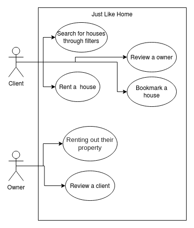
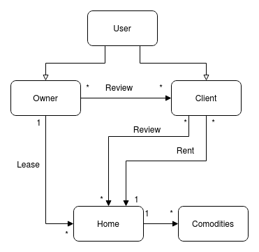
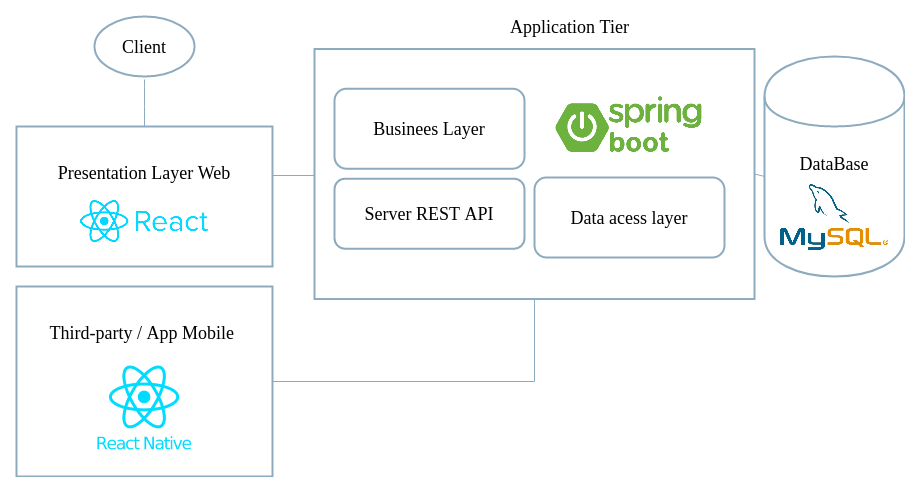
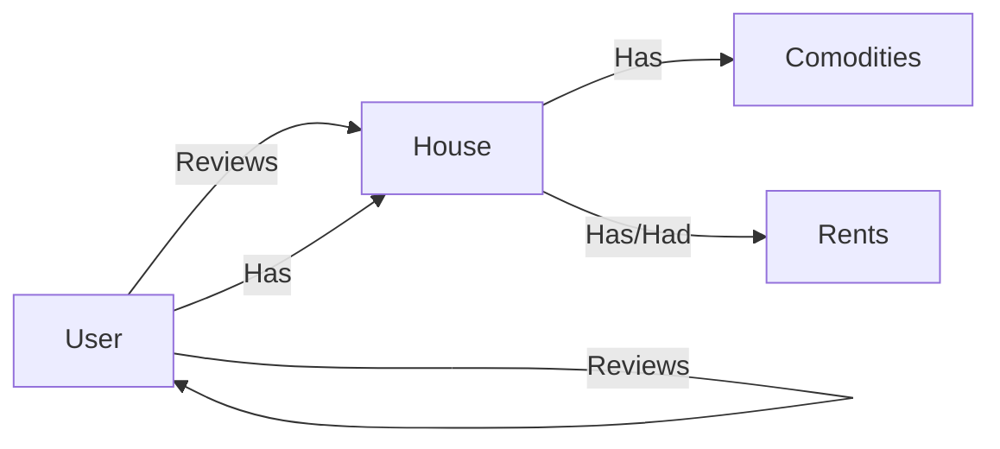

# JustLikeHome

## Índice
1. [Objectivos](#goals)
2. [Casos de Uso](#usecases)
3. [Modelo de domínio](#mdd)
4. [Arquitetura](#arq)
4. [Equipa](#roles)

## Objectivos 

A plataforma JustLikeHome é um sistema para locotários arrendarem seus bens imóveis e para que clientes que estejam a procura de uma residência consigam alugar num determinado tempo, de forma fácil e eficaz. Um dos principais objectivos do sistema na medida de distinguir de outros sistemas dessa área, é que se seja possível realizar reviews não só às residências, mas também que seja possível que o locatário possa fazer review ao cliente.

## Casos de uso 

## Modelo de domínio 

## Arquitetura  

## Roles 

- *Product Owner* - Andre Baiao
- *Team Manager* - Miguel Mota
- *DevOps master* - Luis Fonseca e Joao Silva
- *Developers* - Todos

## High Level Features
- Pesquisar casas tendo como parametros o seguinte: 
    - Localizacao
    - Max Price
    - Rating
    - Datas da estadia
    - Numero de hospedes
    
- Criar uma casa para arrendar com os seguintes parametros:
    - Localizacao
    - Preco por noite
    - Numero de quartos
    - Numero de hospedes
    - Descricao
    - Imagens
    - Cozinha (boolean)
    - Numero de casas de banho
    - Comodidades Extra
    
- Alugar uma casa

- Bookmark como favorito

- Pedir review numa casa que ja tenha estado antes de alugar outra
    - Permite ao sistema ter as casos com um rating mais proximo da realidade
- Permite um owner dar review ao cliente
    - Evita que futuros clientes criem conflitos

## Database
### Entidades
#### User
- ID unique PK
- BirthDate date
- Username string
- Name string
#### House
- ID User - Fk
- ID House - PK
- City string 
- Km from City Center float
- Price per night float
- beds int
- numberOfClients int
#### Comodities
- ID House - PK
- type - string
- description - string

#### Owner Review
- ID Review
- ID Owner
#### House Review
- ID Review
- ID House Review
 
#### Reviews
- ID unique 
- Rating int 0-5
- Description
#### Rents
- ID House
- ID User
- from timestamp
- to timestamp
- rating
 

#### User Stories

#### Backlog
- Jira
